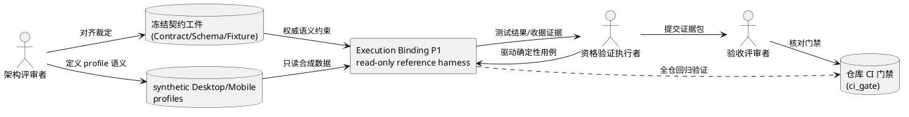
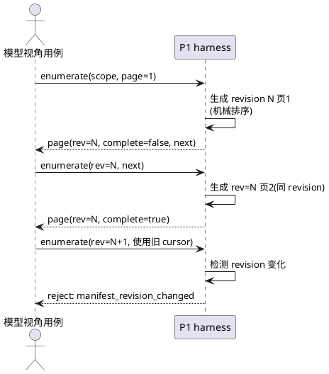
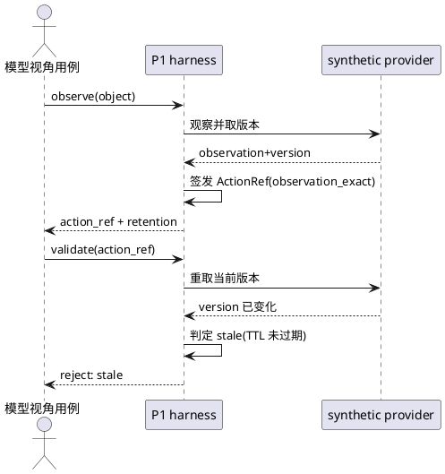
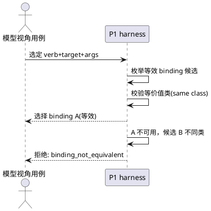
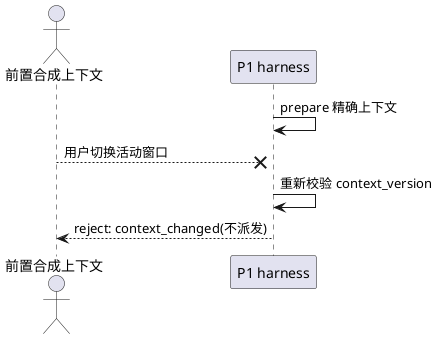
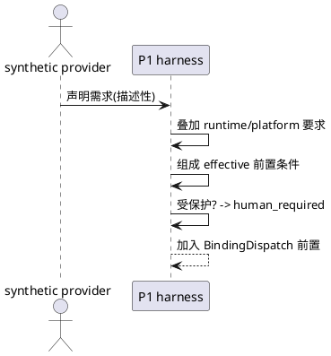
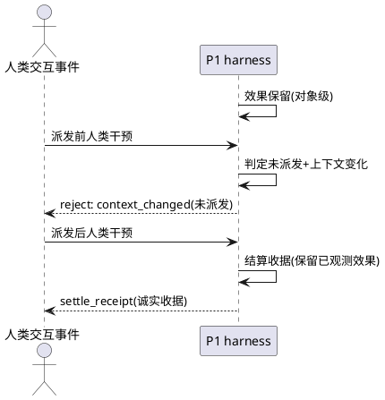

# Execution Binding P1 — Synthetic Desktop/Mobile 只读参考 Harness 需求规格（spec.md）

> 特征：`exec_binding_p1`
> 日期：2026-09-19
> 基线契约：`SMC-EXECUTION-BINDING-CONTRACT-v0.1-20260919.md`（提交 `3b7163a11dca88e7a4e2bd6c6b7146e5925adc31`）
> 父架构：`SMC-AI-NATIVE-CONTROL-PLANE-v0.2-20260919.md` 及 Grill-2 裁定
> 文档类型：需求规格（EARS）—— 描述"做什么"，不含"怎么做"

---

# **1. 组件定位**

## **1.1 核心职责**
本组件负责以 **对真实世界只读** 的方式，在 synthetic Desktop/Mobile 数据源上运行 SMC Execution Binding v0.1 的六项执行机制演练，并额外验证一项跨设备身份边界，
并用确定性测试证明这些机制可运行，为后续真实平台只读观察阶段产出可审计的验收证据。
其核心价值是：**在触碰任何真实 OS 之前，先机械地验证契约语义本身是自洽且可判定可复现的。**

这里的“只读”专指 **不得对真实 OS、真实应用、真实设备产生副作用**。为验证 `after_version`、`observed_effects`、reservation 与 receipt settling，P1 **允许且必须能够**在进程内的 ephemeral synthetic world 中执行受控状态迁移；这些 synthetic 迁移不得逃逸到真实平台。

## **1.2 核心输入**
1. 冻结契约工件：`SMC-EXECUTION-BINDING-CONTRACT-v0.1-20260919.md`、`SMC-EXECUTION-BINDING-SCHEMA-v0.1.json`、`tests/fixtures/smc_execution_binding_v01.json`（24 个冻结 oracle cases，含正向与拒绝场景）。
2. synthetic Desktop profile 数据源：虚构但结构完整的桌面域能力/上下文/对象数据，仅内存或 fixture 承载。
3. synthetic Mobile profile 数据源：虚构但结构完整的移动域能力/上下文/对象数据，仅内存或 fixture 承载。
4. 确定性测试用例集：驱动每个机制的正例与反例指令（含既有 13 个新 deterministic tests 的可复用断言）。

## **1.3 核心输出**
1. Deterministic 测试结果：六项执行机制与一项跨设备身份边界各自的 PASS/FAIL 判定与失败原因，全部可复现。
2. 演练证据：格式化收据/边界事件序列（可审计、可断言、无真实物理副作用）。
3. 资格结论：本次演练是否满足全部 P1-G 验收门限，以及是否满足进入「真实平台只读观察阶段」的前置条件。

## **1.4 职责边界**
本组件 **不负责**：
1. 不接入任何真实 OS adapter（macOS/Windows/Linux/Android/iOS）；真实平台观察属于后续阶段。
2. 不修改任何 `src/` 生产代码；不注册新的工具、不修改工具注册表/工厂。
3. 不建立 provider-visible tool；不改变既有工具对模型的可见性与形态。
4. 不改变 P4-FCR treatment；P4-FCR v0.1 保持不可变且 NOT_QUALIFIED。
5. 不执行任何物理副作用：不产生鼠标/键盘/触控/系统命令派发。
6. 不替代模型职责：不选择语义目标、语义动词、策略、完成判定；不进行"最相关能力"排序。
7. 不实现跨设备全局 Entity 层、不需要证明"同一文件在 Mac 与手机上是同一对象"。
8. 不产出任何语义 fallback 或自动重规划能力。
9. 不把 synthetic world 的内存状态迁移解释为真实平台副作用；不得通过 mock/patch 方式“假装隔离”后仍让真实 OS 控制模块处于可达调用链。

# **2. 领域术语**

**Execution Binding（执行绑定）**
: 将「模型已选定的 SMC 语义动作」映射到「确切平台执行机制」的机械层契约；本阶段仅以 synthetic 数据演练其可运行性。

**CapabilityManifestPage（能力清单页）**
: 能力发现接口按 revision 返回的一页能力数据，页与页之间共享同一 `manifest_revision`，排序确定性、完整性显式声明。

**ActionRef（动作句柄）**
: 指向一条精确运行期绑定记录的短不透明句柄；本阶段只支持 `observation_exact` 有效类。

**observation_exact（观察精确）**
: v0.1 唯一有效类：句柄只有在其绑定的观察/版本仍与当前事实精确一致时才可执行；TTL 只承诺保留，不承诺新鲜。
: 备注：`identity_continuous` 类明确不在 v0.1 内。

**manifest_revision（清单修订号）**
: 能力清单的不可变版本号；光标不得跨 revision 续页，能力引用仅对发布时的 revision 有效。

**equivalent_only（仅等效回退）**
: 自动切换绑定、仅当两个绑定的语义动词/目标契约/参数契约/效果类/幂等类/原子性类/确认语义/权限类/收据义务全部一致时合法。

**InteractionContext（交互上下文）**
: 仅包含上下文敏感绑定所需的可机械观测上下文（活动应用/窗口/焦点对象/输入法等），每个上下文带版本号。

**BindingReceipt（绑定收据）**
: 每次尝试派发都必须产出的可审计记录；必须诚实保留 requested/effective 差异、前后版本、边界事件与副作用观测。

**human preemption（人类抢占）**
: 人类始终保有物理控制权；AI lease 只序列化程序化效果权限，绝不抑制或锁死人类输入。

**synthetic profile（合成画像）**
: 虚构但结构完整的 Desktop/Mobile 域数据，用于在无真实 OS 副作用前提下演练契约机制。

**read-only harness（只读参考台）**
: 本阶段产物形态：一个只消费 synthetic 输入、只产生确定性证据、永不产生真实物理效果的参考性测试台；允许在 ephemeral synthetic world 内发生受控状态迁移，以验证版本、效果与收据语义。

**issuer-scoped portable identity（签发方限定可移植身份）**
: 由 provider 显式给出 `entity_namespace/entity_id/issuer` 的可移植身份；本阶段只验证其边界规则，不做跨设备实体挂接。

# **3. 角色与边界**

## **3.1 核心角色**
- **架构评审者**：定义 synthetic profile 的业务语义与反例意图，保持与 Grill-2 裁定一致。
- **资格验证执行者**：驱动确定性测试套件，收集证据并核对验收门限。
- **验收评审者**：基于 P1-G 门限清单与全仓门禁结果，判定 P1 是否合格、可否进入下一阶段。

## **3.2 外部系统**
- **冻结契约工件集**：P1 的唯一权威语义来源；Contract 定义语义，Schema 定义六个机械信封的结构，24-case fixture manifest 定义已冻结 deterministic oracle。三者角色不得混淆，P1 不得以自身实现反向改写冻结契约。
- **仓库 CI 门禁（ci_gate）**：全仓回归、Ruff/Pyright/安全扫描的执行环境；P1 不得引入任何新红项。

## **3.3 交互上下文**
使用 PlantUML 绘制系统上下文图（仅展示组件级交互，不含内部结构）：

# **4. DFX 约束**

## **4.1 性能**
1. P1 不设置独立的毫秒级/秒级性能硬门限，避免把机器负载波动变成资格结论；唯一阻断条件是正式 `ci_gate` 不能因 P1 新增内容失败或超出仓库自身既定门禁。
2. P1 资格报告必须记录 focused suite 与 full CI 的实际 wall time，仅作为观测值，不作为真实平台性能结论。
3. 本阶段不得用 synthetic 数据推导 Windows/macOS/Linux/Android/iOS 的真实延迟、吞吐、能耗或响应上限。

## **4.2 可靠性**
1. 当同一用例集在同一提交状态上重复执行时，其 **canonical deterministic evidence** 必须逐条一致（无随机、无真实时钟依赖、无外部网络依赖）；验收条件：连续运行两次，去除或固定明确声明的环境性字段后，canonical evidence 的内容与 hash 一致。
2. 当任一 P1 断言失败时，测试必须报告明确的失败原因码（如 `stale`、`manifest_revision_changed`、`context_changed`），不得以笼统错误掩盖判定。
3. 全仓回归必须保持现状全绿基线：`ci_gate` exit 0，不得新增失败测试或阻断项；既有非阻断 warning 必须与失败区分记录。
4. P1 synthetic 时间必须来自固定 logical clock 或等价确定性来源；不得直接把 wall clock 写入 oracle。

## **4.3 安全性**
1. 当 provider 元数据声明任何权限需求时，P1 harness 必须仅将其作为**描述性事实**处理，不得据此授予、豁免或降级任何权限；验收条件：构造"provider 声称权限已满足但 runtime 判定为 deny"的用例，harness 必须输出 `permission_denied`。
2. 当人机并发场景被演练时，P1 lease 模型必须不得产生任何抑制人类输入的语义；验收条件：存在"人类交互发生在 dispatch 前"的用例，harness 输出 `context_changed` 拒绝而非锁死。
3. 本阶段不得产生任何真实物理副作用；验收条件：整个测试过程中无真实输入/系统命令/设备控制/真实 OS adapter 调用路径可达。仅允许 ephemeral synthetic world 的进程内状态迁移。
4. 所有 P1 新增代码必须通过既有安全扫描与 `git diff --check`。

## **4.4 可维护性**
1. 所有 P1 用例必须给出确定性输入（fixture 常量、固定 logical clock、稳定 opaque-id seed 或等价确定性来源），禁止依赖真实时间、非固定随机数或网络。
2. 所有产出证据必须可审计：关键判定需能以收据/边界事件的形式回放。
3. 新增源码必须满足既有 Ruff、Ruff format 与 Pyright（0 error / 0 warning）约束。

## **4.5 兼容性**
1. P1 必须区分三类校验对象：
   - a. `SMC-EXECUTION-BINDING-SCHEMA-v0.1.json` 自身必须是可解析的 Draft 2020-12 schema；
   - b. P1 新增的**正向六信封实例**必须 100% 通过该 schema 校验；
   - c. `tests/fixtures/smc_execution_binding_v01.json` 的 24 个 case 是 deterministic oracle manifest，**不是六信封实例**，不得错误地拿整份 manifest 去套 Execution Binding schema。若新增结构非法反例，应明确预期为 schema reject；若新增语义反例，则应先 schema-valid、再在对应 Gate 被拒绝。
2. P1 不得引入新的 schema revision、不得改变六个机械信封（CapabilityManifestPage/ActionRefRecord/ExecutionBinding/InteractionContext/BindingDispatch/BindingReceipt）的字段语义。
3. Schema 验证能力仅属于 P1 测试/资格链，不得为了 P1 给生产 Runtime 增加新的运行时依赖。

# **5. 核心能力**

> 说明：以下每项机制均为 EARS 需求。验收条件遵循「触发场景 → 预期行为」格式。
> 允许内容：外部行为/验证规则/判定语义；禁止内容：代码结构、数据库、缓存、信号量实现、内部函数签名。
> P1 为测试清晰度新增但未出现在冻结 Contract/24-case oracle 中的诊断码，必须使用 `p1_` 前缀并明确为 harness-local diagnostic；不得因此扩写 SMC v0.1 对外 reason-code 合同。

## **5.1 能力清单分页与发现（manifest paging/discovery）**

### **5.1.1 业务规则**
1. **revision 绑定分页**：当 harness 演练 synthetic 能力枚举时，harness 必须让同一枚举内所有连续页共享同一个 `manifest_revision`。
   - a. 验收条件：第 1 页 `complete=false` 且有 `next_cursor`，第 2 页沿同 revision 续页并在终页 `complete=true, next_cursor=null`；harness 不得把“中间页未完成”错误传播为“最终枚举未完成”。
2. **确定性排序与消费校验分离**：When harness **生成** synthetic 能力页时，P1 必须使用当前冻结 Schema 唯一允许的 `provider_target_verb_capability_v0.1` 排序；When harness **消费** provider 页时，必须验证收到的顺序，不得偷偷重排后继续。Contract prose 虽允许未来 domain profile 声明其他确定性排序，但当前 v0.1 Schema 仍为 const，因此替代排序键明确不属于 P1。
   - a. 验收条件：给出 task relevance ranking → harness 拒绝并报告 `semantic_ranking_forbidden`；给出声明为默认机械排序但实际乱序的页 → harness 拒绝并报告 harness-local `p1_manifest_order_invalid`，不得通过本地 sort 掩盖 provider 违规。
3. **显式完整性**：When 一页 projection 报告 `complete=false` 时，harness 必须同时提供 `next_cursor` 与已返回数量；`total_count` 在 provider 无法机械得知时必须保持空置而非臆造。
   - a. 验收条件：`complete=false` 且无 `next_cursor` → harness 拒绝并报告 `partial_projection_without_cursor`。
4. **禁止静默跨 revision 续页**：If 某一 cursor 携带的 revision 与当前页 revision 不一致，then harness 必须拒绝续页并返回 `manifest_revision_changed`，由模型决定是否重开枚举；不得静默跳到新 revision 继续。
   - a. 验收条件：cursor revision=41、当前 revision=42 → harness 拒绝，原因码 `manifest_revision_changed`。
5. **capability_ref revision 限定**：Where synthetic capability_ref 被使用，harness 必须把它限定在为发布它的 provider 与 revision 内有效，且必须不授予任何权限。
   - a. 验收条件：跨 provider 或跨 revision 使用同一 capability_ref → harness 判定无效引用，且任何情形下不改变权限结论。
6. **特殊类别可表示**：synthetic 页必须可显式表示 `UNSUPPORTED` 与 `HUMAN_REQUIRED` 能力，不得因无法建模而静默丢弃。
   - a. 验收条件：页中含 `HUMAN_REQUIRED` 条目 → harness 保留该条目且其确认/保护语义不回落为普通机械执行。
7. **禁止程序替模型判断**：harness 不得基于"最有用能力"为模型裁剪可见条目；所有过滤必须是模型显式请求的机械过滤（如 `target_kind=document`）。
   - a. 验收条件：程序自行推断"相关能力"并裁剪 → harness 拒绝该行为（用例级拒绝或断言失败）。

### **5.1.2 交互流程**

### **5.1.3 异常场景**
1. **投影中断异常**
   - a. 触发条件：synthetic provider 返回部分投影但无 `next_cursor`。
   - b. 系统行为：harness 标记该页无效，不得假设枚举已完成。
   - c. 用户感知：拒绝 `partial_projection_without_cursor`。
2. **revision 翻转异常**
   - a. 触发条件：枚举进行中 manifest revision 发生变化。
   - b. 系统行为：harness 判定旧 cursor 失效，保留证据供模型决策。
   - c. 用户感知：拒绝 `manifest_revision_changed`。

## **5.2 ActionRef 签发与失效（ActionRef issuance/invalidation）**

### **5.2.1 业务规则**
1. **签发绑定完整**：When harness 演练 ActionRef 签发时，harness 必须把该句柄绑定到 session/device/domain/scope/SemanticObject/observation/observed_version/authority 作用域/完整性/保留期，并绑定 exact grounding 或 exact provider object identity 至少一种；绑定不完整时不得签发。
   - a. 验收条件：缺少任一绑定要素的 synthetic 请求 → harness 拒绝签发。
2. **observation_exact 作为唯一有效类**：When 演练 ActionRef 有效类判定时，harness 必须仅接受 `observation_exact`；`identity_continuous` 等其它类不得进入 v0.1 判定路径。
   - a. 验收条件：输入 identity_continuous 语义 → harness 判定为契约外，拒绝演练。
3. **TTL 仅表示保留**：While ActionRef 未过期，harness 不得仅因 TTL 未过期而判定目标仍然可执行；版本仍必须精确匹配。
   - a. 验收条件：TTL 保留但 `observed_version` 已变化 → harness 拒绝，原因码 `stale`。
4. **严格拒绝集合**：When harness 对 ActionRef 做准入判定时，session 不匹配、authority 不匹配、完整性被篡改、保留期过期、版本不匹配（stale）、身份未解析中的任一单独成立都必须拒绝。
   - a. 验收条件：对六类**单故障**反例逐一演练 → 分别命中可审计拒绝结果；session/authority 不匹配至少归类为 `unauthorized`，其余保持 `integrity_error`/`expired`/`stale`/`identity_unresolved`。
   - b. v0.1 契约未冻结“多个故障同时存在时哪个 reason 优先”；P1 不得通过多故障 fixture 偶然建立新的全局错误优先级。
5. **无隐藏刷新**：Where ActionRef 被判定为 stale 或 expired 时，harness 必须禁止模糊重绑、禁止重新捕获并复用同一句柄、禁止静默签发后继句柄；模型必须重新观察再选择。
   - a. 验收条件：stale 后 harness 尝试 recapture-and-reuse → 断言失败或被显式拒绝。

### **5.2.2 交互流程**

### **5.2.3 异常场景**
1. **陈旧句柄误用**
   - a. 触发条件：对象版本已变但 ActionRef 未过期且密码学完整。
   - b. 系统行为：harness 判定 stale，不尝试重绑/续接。
   - c. 用户感知：拒绝 `stale`。
2. **越会话使用**
   - a. 触发条件：跨 session 使用同一 ActionRef。
   - b. 系统行为：harness 判定 unauthorized。
   - c. 用户感知：拒绝 `unauthorized`。

## **5.3 等价值绑定选择（equivalent binding selection）**

### **5.3.1 业务规则**
1. **等价值类封冻**：When harness 自动选择与某一语义能力等价的 binding 时，harness 必须要求两个 binding 的语义动词、目标 kind/scope、参数契约、效果类、幂等类、原子性类、确认语义、权限类、收据义务全部一致，且属于同一 `equivalence_class_id`。
   - a. 验收条件：任一维不一致 → harness 判定 `binding_not_equivalent`，禁止自动选择。
2. **仅等效回退**：While 某一 binding 在演练中出现不可用，harness 必须执行 `fallback_policy=equivalent_only`；不得静默切换到语义不同的动作。
   - a. 验收条件：不可用 binding 与其候选的语义动词不同 → harness 拒绝回退。
3. **禁止语义改写**：When 组合 BindingDispatch 时，harness 不得重写模型已选定的语义 target/verb/args。
   - a. 验收条件：dispatch 前后 requested 语义摘要必须一致（除非符合 5.5 的用户显式确认参数编辑）。
4. **同一等价类内的选择也必须机械确定**：Where 同一 equivalence class 内同时存在多个可用 binding，P1 harness 必须使用 profile 声明的稳定机械顺序（或稳定 binding_id 顺序）得到确定结果；不得按“成功率、速度、模型偏好、任务相关性”打分。
   - a. 验收条件：同一候选集合重复两次 → 被选 binding 一致；交换输入数组物理顺序但保持声明排序键不变 → 选择结果仍一致。

### **5.3.2 交互流程**

### **5.3.3 异常场景**
1. **跨类静默降级**
   - a. 触发条件：等价 binding 均不可用，代码倾向回退到同类但效果更弱的动作。
   - b. 系统行为：harness 拒绝一切非等效回退，等待模型重新决策。
   - c. 用户感知：拒绝 `binding_not_equivalent`。

## **5.4 上下文竞态拒绝（context-race rejection）**

### **5.4.1 业务规则**
1. **上下文精确前置校验**：When 演练上下文敏感 binding（shortcut/keyboard/pointer/gesture 等）的派发前校验时，harness 必须用 `expected_context_version` 与当前 `context_version` 精确比对。
   - a. 验收条件：版本不一致 → harness 拒绝，原因码 `context_changed`。
2. **用户交互使待派发失效**：While 用户在 prepare 与 dispatch 之间发生了窗口/焦点/前台场景变化，harness 必须拒绝该待派发动作，禁止抢焦、禁止向错误上下文派发。
   - a. 验收条件：TextEdit 论元 + 用户切到 Safari → harness 拒绝 `context_changed`，且不派发。
3. **上下文不敏感动作脱钩**：Where 某 binding 的 `context_preconditions=[]`，harness 不得仅因焦点变化拒绝该动作；是否上下文敏感以 binding 声明为准，而不是仅凭 `DIRECT_SEMANTIC` capability class 猜测。
   - a. 验收条件：`context_preconditions=[]` 的 direct/native semantic action + 焦点变化 → harness 保持 allow 判定。
4. **禁止自动重试**：If 上下文敏感派发被 `context_changed` 拒绝，then harness 必须禁止自动重试或静默重规划。
   - a. 验收条件：拒绝后无任何自动重试证据。

### **5.4.2 交互流程**

### **5.4.3 异常场景**
1. **焦点竞争**
   - a. 触发条件：AI 准备派发快捷键前人类切走焦点。
   - b. 系统行为：harness 拒绝且不抢回焦点。
   - c. 用户感知：拒绝 `context_changed`。
2. **输入法竞态**
   - a. 触发条件：键盘布局/输入法状态在 prepare 与派发间变化。
   - b. 系统行为：harness 视其为上下文变化并拒绝敏感派发。
   - c. 用户感知：拒绝 `context_changed`。

## **5.5 权限/确认组合（permission/confirmation composition）**

### **5.5.1 业务规则**
1. **provider 描述而非授权**：When synthetic provider 元数据声明权限需求或确认需求时，harness 必须将其作为描述性输入，不得据此授予、豁免、降级任何权限，亦不得宣称"用户已确认"。
   - a. 验收条件：provider 声明 `confirmation=none` 但 runtime 要求更高 → harness 按 runtime 要求执行。
2. **有效需求单调合成**：While 叠加平台/runtime/企业策略/当前授权状态/受保护交互策略时，harness 必须把各层约束做单调合取/组合；不得假设所有 permission/confirmation 都能映射成一个可比较的“严格度数字”。任何下层不得撤销上层约束；任一权威层 deny 则不能执行，任一有效策略要求 human-only 则结果保持 `human_required`。
   - a. 验收条件：runtime deny + provider 声称允许 → harness 输出 `permission_denied`；protected human-only → `human_required`。
3. **受保护交互不可自动化绕过**：When 动作要求人类专属受保护交互（解锁/生物认证/安全口令/支付确认/OS 安全权限）时，harness 必须返回 `human_required`，禁止以坐标/视觉方式绕过。
   - a. 验收条件：受保护动作 synthetic 演练 → harness 判定 `human_required`。
4. **用户确认参数编辑是显式协作语义变更**：If 确认表面允许用户编辑参数且用户确实修改，then harness 必须同时保留 requested_action 与 effective_action 并在收据中标注 `user_modified_parameters` 与确认来源，且仅当平台/runtime 确认契约显式把该确认表视为授权编辑表面时才允许继续。
   - a. 验收条件：请求 destination=A、用户改为 B 且确认表被授权 → harness 先把 B 形成新的 effective_action，并重新执行参数 schema、目标 identity/version、capability revision、permission/authority 与适用 context 前置校验；全部通过后才 allow，并保留 requested/effective 双值。
   - b. 若用户编辑使 effective_action 超出原 capability schema、authority scope 或绑定的 exact identity/version，则必须拒绝；“用户确认过”本身不能跳过重新验权。
5. **禁止程序语义改写**：除上一条显式用户编辑外，harness 不得由编译/运行时代码自行产生 requested/effective 语义差异。
   - a. 验收条件：无用户确认但 requested≠effective → harness 拒绝 `semantic_rewrite_forbidden`。

### **5.5.2 交互流程**

### **5.5.3 异常场景**
1. **特权提升通道**
   - a. 触发条件：provider 元数据声称可豁免某强化要求。
   - b. 系统行为：harness 无视该越权声明，按各权威层单调合成后的有效约束判定。
   - c. 用户感知：维持 `permission_denied`/`human_required`，不产生新权限结论。
2. **确认表越权编辑**
   - a. 触发条件：用户经未授权表面产生参数差异。
   - b. 系统行为：harness 判定语义改写。
   - c. 用户感知：拒绝 `semantic_rewrite_forbidden`。

## **5.6 人机并发与人类抢占收据（human-preemption receipts）**

### **5.6.1 业务规则**
1. **人类始终物理抢占**：While 任何 AI lease 生效，harness 的 lease 语义必须不得抑制人类指针/输入/焦点/切窗/触屏/接管。
   - a. 验收条件：存在人类交互事件且 lease 在生效 → harness 记录 `human_interaction_observed`，无任何输入抑制语义。
2. **lease 最小作用域**：When 演练效果保留时，harness 必须把保留限定在对象/文档级别效果，而非整机锁；上下文敏感物理输入可使用覆盖 prepare→revalidate→单次 dispatch 的极短交互 lease，且过期于派发边界。
   - a. 验收条件：无任何"整桌锁"语义出现在 P1 模型中。
3. **已越过 synthetic dispatch boundary 的效果诚实结算**：If synthetic 演练已经跨过“dispatch 已发生”的状态边界，then harness 必须依据 synthetic observed effects 诚实结算收据，禁止虚构"取消=未发生"，且禁止对 non-idempotent 动作自动重放；本条不意味着存在真实物理派发。
   - a. 验收条件：synthetic dispatched 用例 → harness 输出 `settle_receipt` 语义与已观测效果保留，无自动 replay、无真实 OS 调用。
4. **人类干预是证据不是错误**：Where 人类交互或外部主体改变上下文，harness 必须将其作为边界证据记录（`human_interaction_observed`/`context_changed_by_external_actor`），由模型解读其对任务的意义，不得静默吞掉或标记为内部错误。
   - a. 验收条件：人类干预出现 → harness 收据含相关边界事件条目。

### **5.6.2 交互流程**

### **5.6.3 异常场景**
1. **重复派发竞争**
   - a. 触发条件：两个程序化效果竞争同一效果作用域。
   - b. 系统行为：harness 以效果保留序列化竞争，不产生重复派发。
   - c. 用户感知：P1 中后到者必须确定性拒绝并记录 reservation/busy 事实；如需测试专用诊断码，使用 `p1_effect_reserved`。**不实现排队**，避免把延迟后自动执行、stale 与 replay 策略偷偷引入 v0.1。
2. **取消即未发生陷阱**
   - a. 触发条件：动作已派发后被人类打断，代码倾向报告"未发生"。
   - b. 系统行为：harness 依据观测事实结算，不虚构回滚。
   - c. 用户感知：收据保留 observed effects，状态诚实。

## **5.7 跨设备身份边界（cross-device identity boundary）**
**规则意图**：P1 不建设跨设备实体层，但必须机械验证"相似性永不证明同一性"这一边界。
1. **停止启发式合并**：When synthetic 数据中出现同名/同路径/同 hash 的不同本地对象时，harness 必须不建立跨设备链接。
   - a. 验收条件：仅凭名字/内容相似 → harness 判定 `portable_identity_unproven`，拒绝链接。
2. **仅签发方断言可链接**：If 两侧均携带 issuer 给出的 `entity_namespace/entity_id/issuer` 且一致、且存在权威 provider 断言，then harness 可记录两本地对象引用同一可移植实体。
   - a. 验收条件：具备权威断言且三元组一致 → harness 输出 `link_allowed`；任一缺失 → 拒绝。
3. **不出现在核心对象模型**：P1 不得把全局实体生命周期/同步/冲突解决纳入演练范围。

# **6. 验收门限（P1-Gates）**

> 映射约定：本规格的六项执行机制 + 一项跨设备身份边界，对应契约 EB1–EB8 的确定性命中；P1 的验收门限按下表逐条闭合。

| 门限 | 需求条款 | 判定方式 | 结束条件 |
|---|---|---|---|
| P1-G1 清单一致性 | 5.1 | 确定性用例 | 分页/revision/cursor/排序/完整性类断言全绿 |
| P1-G2 ActionRef 精确性 | 5.2 | 确定性用例 | 六类单故障拒绝各自命中、authority/session 边界明确且无隐藏刷新；不冻结多故障优先级 |
| P1-G3 语义等效 | 5.3 | 确定性用例 | 等效选择允许、非等效回退拒绝 |
| P1-G4 授权单调 | 5.5 | 确定性用例 | provider 描述性、runtime/platform 约束单调合成、effective action 重核验、protected→human_required |
| P1-G5 上下文安全 | 5.4 | 确定性用例 | context_changed 拒绝；`context_preconditions=[]` 的 binding 与无关焦点变化脱钩 |
| P1-G6 人类抢占 | 5.6 | 确定性用例 | 不抑制人类、已派发 effect 诚实结算 |
| P1-G7 收据诚实 | 5.6/5.5 | 确定性用例 | requested/effective 零差异或显式用户确认差异；副作用保留 |
| P1-G8 跨设备身份 | 5.7 | 确定性用例 | 仅 issuer 断言可链接，相似性永不链接 |
| P1-G9 契约/schema/fixture 一致性 | 4.5/7.2 | 静态校验 | schema 自身有效；正向六信封实例 100% schema-valid；结构反例按预期 schema-reject；24-case oracle manifest 不被误当六信封实例；无新 revision |
| P1-G10 全仓回归零回归 | 4.2/4.4 | focused + adjacency + ci_gate | 既有 Execution Binding 13/13、SMC contract conformance 15/15、P4-D 19/19 保持全绿；full ci_gate exit 0；Ruff/Pyright/安全扫描通过 |
| P1-G11 零真实副作用边界 | 1.4/4.3 | 静态/动态检查 | 无真实输入/命令/设备控制/真实 OS adapter 可达路径；允许且仅允许 ephemeral synthetic state mutation；无生产代码变更 |
| P1-G12 证据确定性 | 4.2 | 双运行对比 | 同 exact commit 连续两次 canonical evidence 内容/hash 一致；环境性字段被固定或明确排除 |

**结束判据**：P1-G1..G12 全部为绿色 且 既有 24 个冻结 oracle cases、13 个 Execution Binding deterministic tests、15 个 SMC contract conformance tests、19 个 P4-D adjacency tests 保持全绿，
即认为 P1 达成「synthetic Desktop/Mobile 只读参考验证合格」，可申请进入下一阶段（真实平台只读观察）。

# **7. 数据约束**

## **7.1 六个机械信封（契约对象）**
1. **CapabilityManifestPage**：必须携带 schema/`manifest_ref`/`manifest_revision`/provider/domain/scope/ordering/filters/items/projection；**P1 按当前冻结 Schema 只接受** `ordering=provider_target_verb_capability_v0.1`；projection 必须含 complete/returned_count/total_count(可空)/next_cursor。其他 profile-specific ordering 留给未来明确 schema revision，不在 P1 偷渡。
2. **ActionRefRecord**：必须绑定 session/device/domain/scope/SemanticObject id/observation/observed_version/authority_scope/grounding 或 provider 对象身份/integrity/issued_at/expires_at；`validity_class` 恒为 `observation_exact`；grounding_ref 与 provider_object_ref 至少其一。
3. **ExecutionBinding**：必须含 binding_id/capability_ref/manifest_revision/binding_class/equivalence_class_id/语义五要素/效果与幂等原子类/权限与确认需求/context_preconditions/`fallback_policy=equivalent_only`/receipt_obligations。
4. **InteractionContext**：必须含 context_ref/context_version 及各可空上下文事实字段，并声明 completeness。
5. **BindingDispatch**：必须含 action_id/action_ref/capability_ref/manifest_revision/binding_id/requested_action/期望 observation 与 version/期望 context ref 与 version/authority_check_ref/confirmation_ref/effect_reservation_ref。
6. **BindingReceipt**：必须含 action_id/requested_action/effective_action/user_modified_parameters/confirmation_ref/binding_id/binding_class/attempt/status/reason/前后 version/前后 context/observed_effects/boundary_events/automatic_replay/completeness。

## **7.2 synthetic profile 数据**
1. **Desktop profile 能力项**：每条能力必须能表示 target_kind/semantic_verb/effect 类/幂等类/原子性类/权限需求/确认需求/等价类 id，且无遗漏地落入既有枚举。
2. **Mobile profile 能力项**：与 Desktop 同构；P1 同样使用当前 Schema 的固定排序键，不引入独立 ordering revision；移动特有上下文（orientation/virtual_keyboard）必须可表示。
3. **合成用例集合**：必须覆盖 5.1–5.7 的正向与拒绝路径，并明确区分：
   - a. 六信封结构实例：正例必须通过 Execution Binding schema；结构非法反例必须按预期 schema-reject；
   - b. deterministic oracle case：遵循既有 24-case fixture manifest 的 `case_id/gate/kind/input/expected/invariant` 语义，不要求 oracle manifest 本身符合六信封 schema；
   - c. 语义反例优先保持 schema-valid，再由对应 EB/P1 Gate 拒绝，以防“结构坏了”掩盖“语义边界没测到”。
4. **收据字段**：每次演练的收据不得缺 field，且 `status`/`reason` 必须与本章语义表格允许的码集一致。

# **8. 证据包与停止条件**

## **8.1 P1 资格证据包**
P1 收口时必须至少冻结以下证据，且彼此绑定同一 exact Git commit：

1. synthetic Desktop/Mobile profile 及其内容 hash；
2. 新增正向六信封实例与 deterministic oracle case 清单；
3. P1-G1..G12 的逐 Gate 结果；
4. 两次 canonical evidence 的 hash 与一致性结论；
5. focused/adjacency 测试计数与 full `ci_gate` 最终 exit status；
6. 零真实副作用审计结论，明确 synthetic mutation 与真实 OS effect 的边界；
7. `git diff --check`、Ruff、Pyright、安全扫描与 worktree 状态；
8. 明确 non-claims：不得把 P1 结果描述为真实 OS adapter、真实用户并发安全或模型 FCR 已验证。

## **8.2 合同冲突停止条件**
If P1 实现过程中发现 frozen Contract / Schema / 24-case fixture 之间存在无法同时满足的矛盾，then：

1. P1 必须停止在该矛盾处并冻结最小复现；
2. 不得在 P1 中私自修改 Contract/Schema 来让测试通过；
3. 不得通过 scorer 容忍、normalization、silent fallback 或放宽断言掩盖冲突；
4. 返回架构/合同评审，另起明确 revision 才能改变冻结语义。

## **8.3 阶段边界**
P1-G1..G12 全绿只授予“申请进入真实平台只读观察”的资格，不自动启动：

- macOS/Windows/Linux/Android/iOS adapter；
- 真实平台 mutation；
- P4-FCR v0.2；
- P4-LIVE；
- provider-visible tool；
- 部署/重启。

进入下一阶段必须重新冻结独立 scope、协议与 Gate。